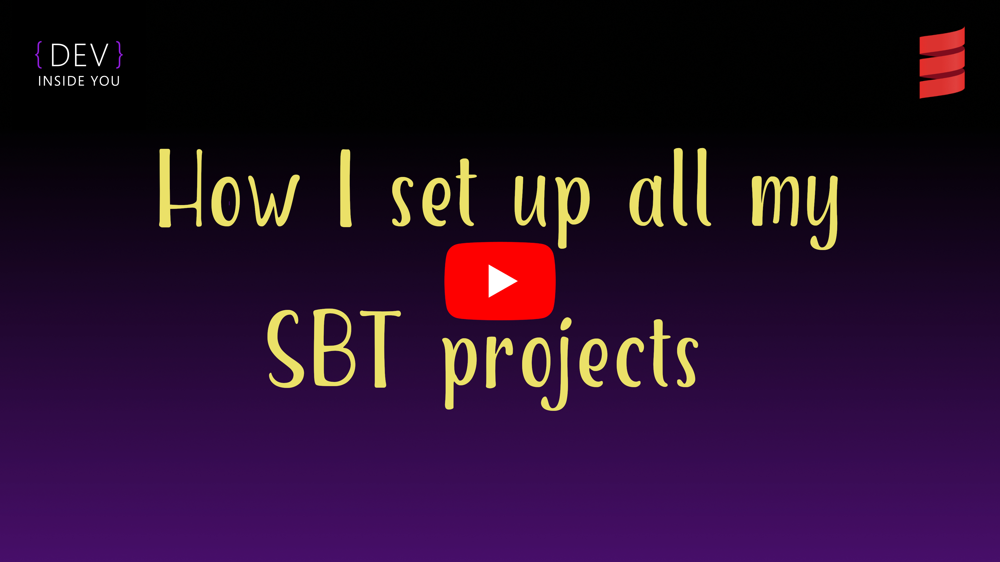

# A [Giter8][g8]/[SBT][sbt]/[Scala][scala] template

A Giter8 template for a fully configured Scala SBT single but multibuild ready project. It is configured in a slightly opinionated but mostly dependency free fashion.

All versions will always stay hardcoded as opposed to being chooseable or automatically updatable via Giter8 in order to guarantee the soundness of the build. In other words, assuming you don't have any global settings/plugins the build won't break unless you manually break it by changing versions by hand. Enjoy!

```bash
sbt new devinsideyou/scala-seed.g8  # for Scala 2.x
sbt new devinsideyou/scala3-seed.g8 # for Scala 3.x
```

or

```bash
g8 devinsideyou/scala-seed  # for Scala 2.x
g8 devinsideyou/scala3-seed # for Scala 3.x
```

[](https://www.youtube.com/watch?v=nD-p-cEKjHE "Watch on YouTube")

[g8]: http://www.foundweekends.org/giter8/
[sbt]: https://www.scala-sbt.org/
[scala]: https://www.scala-lang.org/
